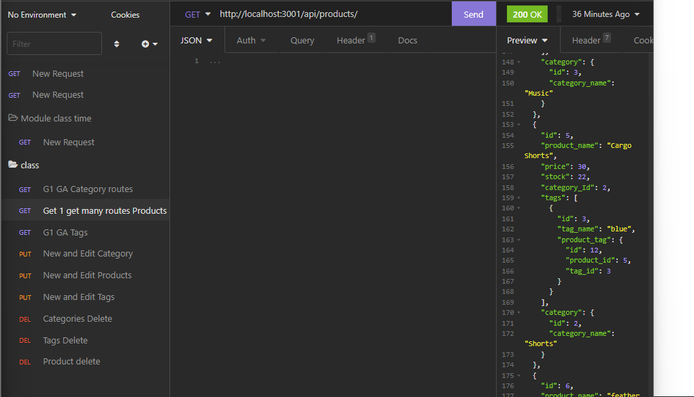

# ServeStack

## Description 

This back end product allows users to view, add, modify, and delete categories, products, and tags for those products. It is a dynamic back end that will connect well with a front end.

[Video-Link](https://drive.google.com/file/d/1Smp35xcx1mPN-8YUDZKtE0ZKS76j99cg/view)

## Table of Contents 

[Description](#description)
[Installation](#installation)
[Usage](#usage)
[License](#license)
[Contribute](#contribute)
[Tests](#tests)
[Questions](#questions)
 
## Installation

To install ServeStack, copy the github repository link, and clone down the repository in desired folder. Use NPM install to install needed dependencies.

## Usage

This application would be useful to an ecommerce store trying to build up a website for their products.

## License

No license used

## Contribute

This Application doesn't accept contributions.

## Tests

I used many tests to make this app

## Questions

GitHub: [Elenalaree](https://github.com/elenalaree)

